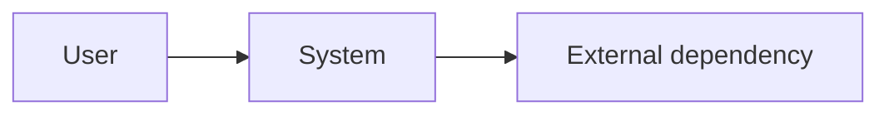
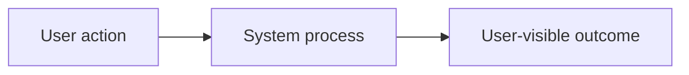
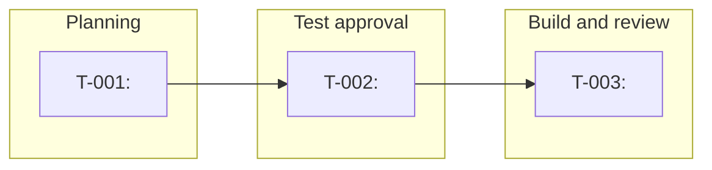

# Agentic Workflow Artifact Templates

Copy the relevant template into the canonical location. Replace bracketed
placeholders only with confirmed information. Ticket acceptance tests are the
executable source of truth: scripts and harnesses may support a test command,
but cannot substitute for the ticket test.

## `CONTEXT.md`

````md
# Repository Context: <repository name>

## Purpose and Scope
<Confirmed product purpose, users, and repository scope.>

## Domain Glossary
| Term | Confirmed meaning |
| --- | --- |
| <term> | <meaning> |

## Component Inventory
| Component | Responsibility | Owner or boundary |
| --- | --- | --- |
| <component> | <responsibility> | <boundary> |

## Module Seams
| Producer | Interface | Consumer | Contract |
| --- | --- | --- | --- |
| <module> | <input/output interface> | <module> | <contract> |

## Architecture


## Workflow


## Cross-Cutting Constraints
- <security, performance, compatibility, operational, or policy constraint>

## Decisions
| Date | Decision | Rationale | Status |
| --- | --- | --- | --- |
| <YYYY-MM-DD> | <decision> | <why> | confirmed |

## Open Questions
- <Question requiring a user decision.>
````

## `SPECIFICATION.md`

```md
# Specification: <feature name>

## Context Links
- [Repository Context](../../CONTEXT.md#<relevant-section>)

## Goal
<Confirmed user-visible outcome.>

## In Scope
- <behavior>

## Out of Scope
- <excluded behavior>

## Requirements
1. **R-001**: <confirmed functional requirement>

## Interfaces
| Input | Source | Output | Consumer |
| --- | --- | --- | --- |
| <input> | <source> | <output> | <consumer> |

## Acceptance Criteria
1. **AC-001**: <observable end-to-end criterion>

## Requirement Traceability
| Requirement | Acceptance criteria | Expected test type and seam | Slicing status |
| --- | --- | --- | --- |
| R-001 | AC-001 | `<acceptance/integration/...>` at `<real boundary>` | ready to slice |

## Constraints and Dependencies
- <constraint or dependency>

## Open Decisions
- <Question requiring user confirmation; do not implement until resolved.>
```

## Ticket card: `tickets/T-001-<slug>.md`

```md
# T-001: <ticket title>

## Lane and Status
- Lane: <planning | test approval | build/review>
- Status: <not ready | ready for test | RED recorded | awaiting approval | locked | in progress | reviewed | consolidated>

## End-to-End Behavior
<The independently testable, user-visible behavior this card delivers.>

## Acceptance Criteria
1. <observable criterion>

## Test Contract
- Acceptance test path: `<path>`
- Test command: `<command>`
- Expected RED outcome: `<specific failing assertion or failure>`
- Expected GREEN outcome: `<passing assertion and exit status>`
- Ticket tests are the executable source of truth; scripts or harnesses do not substitute for them.

## RED/GREEN Record
| Phase | Command | Outcome | Date | Evidence |
| --- | --- | --- | --- | --- |
| RED | `<command>` | <intentional failure> | <YYYY-MM-DD> | <failure reference> |
| GREEN | `<command>` | <passing result> | <YYYY-MM-DD> | <result reference> |

## File Ownership
| Area | Owned paths | Shared or excluded paths |
| --- | --- | --- |
| Production | `<path>` | <paths another card owns> |
| Tests | `<path>` | <paths another card owns> |

## Interface Contract
| Inputs consumed | Outputs produced | Error or boundary behavior |
| --- | --- | --- |
| <typed/structured inputs> | <observable outputs> | <failure semantics> |

## Dependencies and Blockers
- Dependencies: <ticket IDs or none>
- Blockers: <blocking decision, approval, or none>

## Test Lock
- Test lock: `<../test-locks/T-001.md>` or `not created`
- The test lock is created only after intentional RED and explicit user approval.
- Once intentional RED is recorded, every test artifact for this card is immutable.
  Any subsequent test edit, including conflict resolution, requires explicit user
  authorization → changed-test edit → fresh intentional RED → new approval → new lock.

## Review and Consolidation
- Task review: <pending | approved | changes requested>
- Review record: `<../reviews/T-001.md>` or `not created`
- Consolidation wave: <wave ID>
- Consolidation status: <not ready | queued | merged | full suite passed>
```

## Test lock: `test-locks/T-001.md`

```md
# Test Lock: T-001

## Preconditions
- Intentional RED was run: <yes; command and failure recorded below>
- Explicit user approval reference: <approval message/link/date>

## Locked Test Manifest
| Test artifact path | SHA-256 hash |
| --- | --- |
| `<path>` | `<hash>` |

Record one path/hash pair for every locked test artifact for this card,
including the acceptance test, any existing test, and committed test data.

- Locked at: <YYYY-MM-DD>
- Acceptance criteria covered:
  1. <criterion>

## RED Evidence
- Command: `<command>`
- Result: <specific intentional failure>
- Evidence: <log, CI, or command-output reference>

## Immutability Rule
Once intentional RED is recorded, every test artifact for this card is
immutable. Do not modify a test for any reason, including merge-conflict
resolution, unless the user explicitly authorizes the change. Make the
authorized edit, re-run intentional RED, obtain a new approval, then replace
and verify this manifest. Scripts and harnesses cannot replace the locked test.
```

## Review record: `reviews/T-001.md`

```md
# Review Record: T-001

## Inputs Reviewed
- Ticket: `<../tickets/T-001-<slug>.md>`
- Test lock: `<../test-locks/T-001.md>`
- Locked test hash verified: <yes/no; observed hash>
- Specification and Context links reviewed: <links>

## Standards and Specification Review
| Check | Result | Evidence or required action |
| --- | --- | --- |
| End-to-end behavior delivered | <pass/fail> | <evidence> |
| Acceptance criteria met | <pass/fail> | <evidence> |
| Locked test unchanged | <pass/fail> | <evidence> |
| No script substituted for tests | <pass/fail> | <evidence> |
| Ownership and interfaces respected | <pass/fail> | <evidence> |

## Commands Run
| Command | Result |
| --- | --- |
| `<ticket test command>` | <result> |
| `<relevant suite command>` | <result> |

## Decision
- Status: <approved | changes requested>
- Reviewer: <name>
- Date: <YYYY-MM-DD>
- Required follow-up: <none or action>
```

## `DEBUG-KANBAN.md`

```md
# Debug Kanban: <bug slug>

## Reported Behavior
<Confirmed observed failure and affected user/system behavior.>

## Reproduction Contract
- Regression test path: `<path>`
- RED command: `<command>`
- Expected RED outcome: <specific failure>
- User approval required before lock: <pending/approval reference>

## Constraints
- The regression test becomes immutable immediately when intentional RED is recorded.
- No script or harness may substitute for the regression test.
- A subsequent change requires explicit authorization → changed-test edit → fresh
  intentional RED → new approval → new lock before continuing.

## Cards
| ID | End-to-end diagnostic or fix behavior | Lane/status | Owner paths | Blockers |
| --- | --- | --- | --- | --- |
| D-001 | <reproduce or diagnose one testable behavior> | <lane/status> | <paths> | <none or dependency> |

## Evidence and Decisions
| Date | Evidence or decision | Result |
| --- | --- | --- |
| <YYYY-MM-DD> | <command, observation, or decision> | <result> |
```

## `KANBAN.md`

```md
# Kanban: <feature name>

## Source Artifacts
- [Context](../../CONTEXT.md)
- [Specification](SPECIFICATION.md)

## Operating Rules
- Each card delivers one independently testable end-to-end behavior.
- A card needs acceptance criteria, a test contract, ownership, and dependencies before it is ready.
- Run the acceptance test intentionally RED, obtain explicit user approval, then create the test lock.
- Once intentional RED is recorded, every card test artifact is immutable; any
  later edit, including conflict resolution, requires authorization, a fresh RED,
  new approval, and a replacement lock manifest.
- Scripts and harnesses cannot substitute for acceptance tests.
- Only dependency-free cards with non-overlapping production and test ownership may be parallelized in isolated worktrees.
- Review every card before consolidation; run the full suite after each consolidated wave.

## Cards
| ID | Behavior | Dependencies | Lane | Status | Ticket | Test lock | Review |
| --- | --- | --- | --- | --- | --- | --- | --- |
| T-001 | <end-to-end behavior> | none | planning | ready for test | [card](tickets/T-001-<slug>.md) | pending | pending |
| T-002 | <end-to-end behavior> | T-001 | test approval | blocked | [card](tickets/T-002-<slug>.md) | pending | pending |
| T-003 | <end-to-end behavior> | T-002 | build/review | blocked | [card](tickets/T-003-<slug>.md) | pending | pending |

## Wave Plan
| Wave | Eligible cards | Consolidator | Full-suite result |
| --- | --- | --- | --- |
| 1 | T-001 | <name> | pending |
| 2 | T-002 | <name> | pending |
| 3 | T-003 | <name> | pending |


