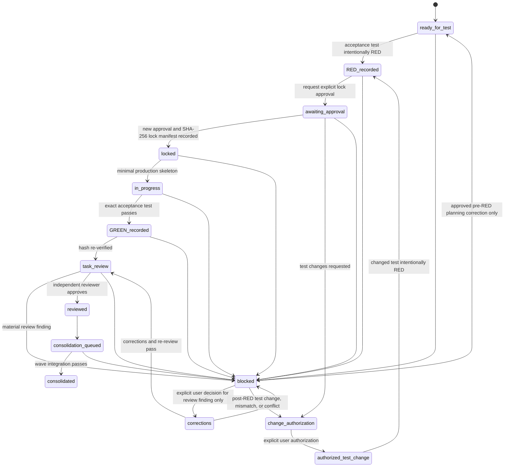

# Kanban Execution Policy

This policy executes only final user-approved Kanban cards through
`skills/vertical-tdd/`. It preserves the approved specification, test
contract, file ownership, and dependency graph; it does not re-plan them.
Scripts or harnesses are never proof in place of a card's real tests.

## Card State Machine

The `blocked` transition is mandatory for ambiguity, a dependency or ownership
conflict, a failing test, stale approval or hash, a review finding, or an
unresolved merge conflict. Ask the user for the precise decision; never choose
or repair an ambiguous result silently.

## Post-RED Test-Change Route

Any post-RED test change, including merge-conflict resolution, must take this
path and no other:

1. enter `change_authorization` and obtain explicit user authorization to
   change that specific test;
2. only after authorization, change the test and run the changed test to
   intentional RED;
3. obtain a new explicit user approval of that RED result;
4. calculate and record a new SHA-256 test-lock manifest; and
5. verify the new lock before returning to `in_progress` or any production
   work.

An earlier test-lock approval, code-review approval, merge approval, or
instruction to continue is not authorization to change a post-RED test and
does not satisfy the new approval. No production change, review approval,
merge, or consolidation may resume before the new lock is recorded and
verified.

## Required Lifecycle Evidence

Each state transition must be reflected in the final ticket card and committed
on the card branch. The ticket's RED/GREEN table records test command and
result. Required durable evidence is:

| Transition | Required record and commit |
| --- | --- |
| `ready_for_test → RED_recorded` | Acceptance-test authoring and exact RED evidence in the ticket |
| `RED_recorded → locked` | Test-lock document with approved SHA-256 manifest and approval reference |
| `blocked → authorized_test_change → RED_recorded → locked` | Explicit change authorization, changed-test RED evidence, new approval, and new SHA-256 lock manifest |
| `locked → GREEN_recorded` | Minimal production change, exact GREEN result, and changed ownership paths |
| `task_review → blocked → corrections → task_review` | Material finding, explicit user correction decision, correction commit, and new independent review |
| `GREEN_recorded → reviewed` | Independent task review at `reviews/<ticket>.md` |
| `reviewed → consolidated` | Wave integration report at `reviews/waves/<wave>.md` and consolidation merge |
| any transition to `blocked` | Ticket blocker and lifecycle report entry naming the failure and user decision needed |

Do not combine lifecycle evidence in an unreviewable bulk commit. The lock
commit must contain the approved lock record. The completion commit must not
modify a locked test. Corrections after task review require a new completion
commit and a new independent review record. A test change follows the
re-approval procedure in `test-lock-policy.md`, including its new RED and lock
commits.

## Wave Admission

The coordinator selects a wave only when every candidate card has a
user-approved final Kanban card and test contract, all dependency predecessors
are consolidated, and each candidate declares production and test ownership.

Cards may run in the same parallel wave only when:

1. no same-wave dependency edge exists in either direction;
2. their owned production paths do not overlap;
3. their owned test paths do not overlap; and
4. no owned path is a parent or child of any other owned path in the same
   category or across declared production/test ownership.

If any ownership relation is missing or conflicts, do not guess. Block the
cards, request a corrected ownership decision, recompute the DAG, and schedule
them serially unless an approved plan makes them safe to separate.

Every admitted card gets an isolated worktree and branch. Shared-tree
execution, copying uncommitted changes between card worktrees, and merging one
executor's work directly into another executor's worktree are prohibited.

## Roles Per Card and Wave

For every card, assign a fresh executor subagent who did not create that
card's approval artifacts. The executor subagent invokes vertical TDD and only
works within the card's declared paths.

An independent task-reviewer subagent, distinct from the executor subagent,
verifies the linked specification and Context, applicable AI standards, exact
acceptance command, test-lock hash, ownership, and absence of test-substitute
scripts. A material finding transitions the card from `task_review` to
`blocked`. Before any correction, the user must make an explicit decision that
approves the correction scope; only then may the card transition from `blocked`
to `corrections`. The executor subagent corrects only that approved scope, and
the task-reviewer subagent performs a new independent review. The card cannot
queue for consolidation until the new review record is approved.

Each parallel wave gets one fresh consolidation subagent in the integration
branch/worktree; it must be distinct from that wave's executors and
task-reviewer subagents. The consolidation subagent must:

1. verify each approved card's test-lock fields, approval reference, and every
   current SHA-256 manifest hash before merging;
2. refuse a stale hash, test conflict, missing review, incomplete lifecycle
   commit, or failed card test;
3. merge only approved, reviewed cards;
4. run the repository's full test suite and record the command and result;
5. issue the wave integration review, checking cross-card behavior,
   ownership, locks, specification compliance, applicable AI standards, and
   no script substituted for a test; and
6. commit the integration report and update Kanban consolidation state before
   unlocking the next wave.

A serial wave uses the same consolidation gate with a fresh consolidation
subagent before a subsequent wave can begin.

A full-suite failure, merge conflict, or integration-review finding blocks the
wave. The consolidator must request user direction when resolving it would
change an approved test, ownership declaration, behavior, or dependency plan.

## Lock Enforcement at Integration

The test lock is checked before production work, task review, card merge, and
wave integration review. A hash mismatch or locked-test merge conflict returns
the card to `change_authorization`; it is removed from the wave until it
obtains explicit authorization for that test change, runs the changed test to
intentional RED, obtains a new explicit approval, records a new SHA-256 lock,
and verifies every manifest hash. The executor, reviewer, and consolidator may not
resolve the conflict or resume production before that sequence completes.
